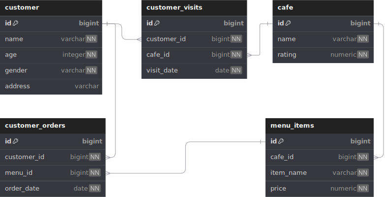

# Module 1

## Content

1. [Chapter I](#chapter-i)
2. [Chapter II](#chapter-ii)\
    2.1. [Task 1](#task-1)\
    2.2. [Task 2](#task-2)\
    2.3. [Task 3](#task-3)\
    2.4. [Task 4](#task-4)\
    2.5. [Task 5](#task-5)\
    2.6. [Task 6](#task-6)\
    2.7. [Task 7](#task-7)\
    2.8. [Task 8](#task-8)\
    2.9. [Task 9](#task-9)\
    2.9. [Task 10](#task-10)

## Chapter I



1. Таблица cafe (Справочник с доступными кофейнями)

    - поле id - первичный ключ
    - поле name - название кофейни
    - поле rating - средний рейтинг кофейни (от 0 до 5 баллов)

2. Таблица customer (Справочник с клиентами, любящими кофе)

    - поле id - первичный ключ
    - поле name - имя клиента
    - поле age - возраст клиента
    - поле gender - пол клиента
    - поле address - адрес клиента\

3. Таблица menu_items (Справочник с доступным меню и ценами на конкретные напитки)

    - поле id - первичный ключ
    - поле cafe_id - внешний ключ на кофейню
    - поле item_name - название напитка в кофейне
    - поле price - цена конкретного напитка

4. Таблица customer_visits (Операционная таблица с информацией о посещениях кофейни)

    - поле id - первичный ключ
    - поле customer_id - внешний ключ на клиента
    - поле cafe_id - внешний ключ на кофейню
    - поле visit_date - дата (например, 2022-01-01) посещения клиентом

5. Таблица customer_orders (Операционная таблица с информацией о заказах клиентов)

    - поле id - первичный ключ
    - поле customer_id - внешний ключ на клиента
    - поле menu_id - внешний ключ на меню
    - поле order_date - дата (например, 2022-01-01) заказа клиентом

Посещения и заказы клиентов являются разными сущностями и не содержат корреляции между данными. Например, клиент может находиться в кофейне (просто просматривая меню) и одновременно делать заказ в другой кофейне по телефону или мобильному приложению. Или другой случай, просто находиться дома и снова делать заказ по телефону без каких-либо посещений.

[файл с моделью базы данных](materials/model.sql)

## Chapter II

Все задания надо выполнять в отдельных файлах, названых по примеру `Task 1 -> task_1.sql` 

### Task 1

- Выполните запрос SELECT, который возвращает имена (`name`) и возраст (`age`) всех клиентов (`customer`) из города `Kazan`.

### Task 2

- Выполните запрос SELECT, который возвращает имена (`name`) и возраст (`age`) всех женщин из города `Kazan`. И, пожалуйста, отсортируйте результат по имени.

### Task 3

- Выполните два запроса SELECT с разным синтаксисом, которые возвращают список кофеен (`cafe`) (название (`name`) и рейтинг (`rating`)) с рейтингом от 3,5 до 5 баллов (включая граничные значения) и упорядоченные по рейтингу кофеен.
  - В первом запросе должны использоваться знаки сравнения (<=, >=);
  - Во втором запросе должно использоваться ключевое слово `BETWEEN`.

### Task 4

- Выполните запрос SELECT, который возвращает идентификаторы клиентов (без дубликатов), которые посещали кофейни в период с 6 по 9 января 2022 года (включительно) или посещали кофейни с идентификатором 2. Также включите сортировку по идентификатору клиента в порядке убывания.

### Task 5

- Выполните запрос SELECT, который возвращает одно вычисляемое поле с именем ‘информация_о_клиенте’ в одной строке, как описано в следующем примере:

    `Anna (age:16,gender:'female',address:'Moscow')`

    В конце добавьте условие сортировки по вычисляемой колонке в порядке возрастания.Обратите внимание на кавычки в вашей формуле!

### Task 6

- **Ограничения:** `IN`, любые типы `JOIN`
- Напишите запрос SELECT, который возвращает имена клиентов (на основе внутреннего запроса в предложении SELECT), которые разместили заказы на меню с идентификаторами 13, 14 и 18, и дата заказов должна быть 7 января 2022 года. Будьте внимательны к **Ограничению** перед выполнением вашей работы.
- Обратите внимание на шаблон внутреннего запроса.

    ```SQL
    SELECT 
        (SELECT ... ) AS NAME  -- это внутренний запрос в основном предложении SELECT
    FROM ...
    WHERE ...
    ```

### Task 7

- **Ограничения:** `IN`, любые типы `JOIN`
- Используйте конструкцию SQL из [Task 6](#task-6) и добавьте новое вычисляемое поле (используйте имя колонки ‘check_name’) с проверочным предложением (псевдокод для этой проверки приведен ниже) в предложении SELECT.

        если (имя_клиента == 'Денис') тогда вернуть true
        иначе вернуть false

### Task 8

- Примените интервалы данных к таблице `customer`.
Составьте SQL-запрос, который возвращает идентификаторы клиента, имена клиентов и интервал возраста клиентов (назовите новую вычисляемую колонку 'interval_info') на основе псевдокода ниже.

        если (возраст >= 10 и возраст <= 20) тогда вернуть 'интервал #1'
        иначе если (возраст > 20 и возраст < 24) тогда вернуть 'интервал #2'
        иначе вернуть 'интервал #3'

    И, да... пожалуйста, отсортируйте результат по колонке ‘информация_об_интервале’ в порядке возрастания.

### Task 9

- Создайте SQL-запрос, который возвращает все колонки из таблицы `customer_orders` с записями, чей идентификатор является четным числом. Результат должен быть упорядочен по возвращаемому идентификатору.

### Task 10

- Составьте запрос SELECT, который возвращает имена клиентов и названия кофеен на основе таблицы `customer_visits` с датой посещения в период с 7 по 9 января 2022 года (включая все дни) (на основе внутреннего запроса в предложении FROM).

    Обратите внимание на шаблон конечного запроса.

    ```SQL
    SELECT (...) AS имя_клиента,  -- это внутренний запрос в основном предложении SELECT
            (...) AS название_кофейни  -- это внутренний запрос в основном предложении SELECT
    FROM (SELECT … FROM customer_visits WHERE …) AS cv -- это внутренний запрос в основном предложении FROM
    ORDER BY ...
    ```

- Добавьте условие сортировки по имени клиента в порядке возрастания и по названию кофейни в порядке убывания.